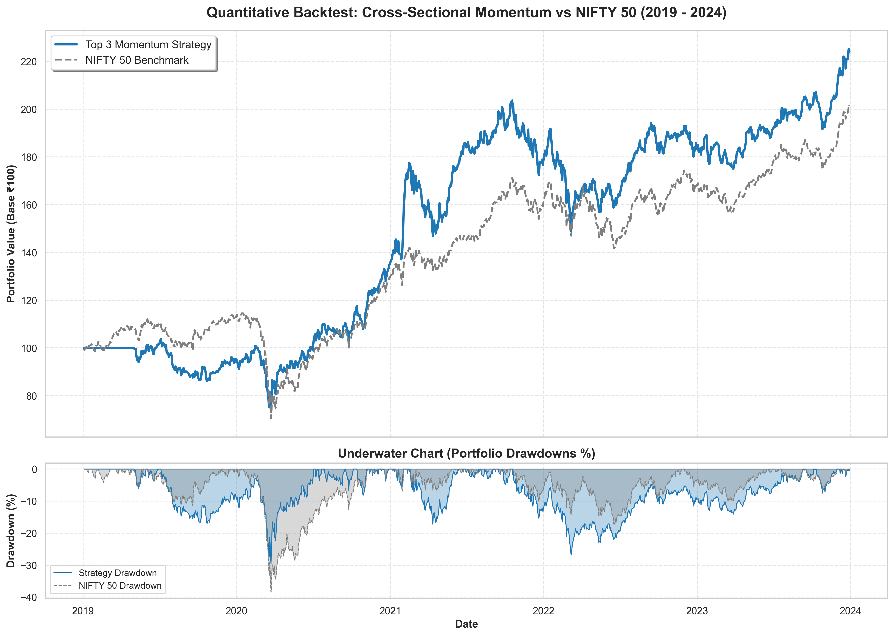

# **📈 NSE Market Analytics & Quantitative Momentum Strategy**

**🔴 LIVE DASHBOARD:** [Click here to view the Streamlit App](https://nse-momentum-strategy-kt2pvz37clnqwqeakgd4bx.streamlit.app/)

## **📝 Project Overview**

An end-to-end quantitative finance project analyzing 5 years of historical data for large-cap Indian stocks (NSE). The project features an interactive web dashboard built with Streamlit and implements a **Cross-Sectional Momentum Trading Strategy** that dynamically rebalances a portfolio to outperform the NIFTY 50 benchmark.

## **⚙️ Quantitative Strategy Logic**

This project backtests a relative momentum anomaly:

1. **Universe:** 10 Large-Cap NSE Stocks.  
2. **Signal:** 3-Month (63 trading days) rolling percentage returns.  
3. **Execution:** Rank stocks by momentum score. Buy the Top 3 performing stocks at the end of each month.  
4. **Weighting:** Equal weight (33.33% each).  
5. **Risk Management:** Strategy explicitly strictly delays execution by 1 day (shift) to eliminate look-ahead bias.

## **📊 Backtest Results (2019 \- 2024\)**

*Note: The risk-free rate used for the Sharpe Ratio is the 6.5% Indian 10-Year G-Sec yield.*

Strategy outperformed NIFTY 50 by \+2.54% CAGR

| Metric | Cross-Sectional Momentum | NIFTY 50 (Buy & Hold) |
| :---- | :---- | :---- |
| **CAGR** | 17.92% | 15.38% |
| **Sharpe Ratio** | 0.57 | 0.51 |
| **Max Drawdown** | \-29.54% | \-38.44% |
| **Win Rate** | 52.94% | 55.00% |
| **Beta** | 0.87 | 1.00 |

*Note: A Sharpe ratio of 0.57 is acceptable because the backtest period includes the COVID crash of 2020\.*

### **Strategy Equity Curve vs Benchmark**
   

## **💻 Tech Stack**

* **Data Gathering:** yfinance (Live API connection)  
* **Data Processing:** pandas, numpy (Vectorized operations for speed)  
* **Visualization:** matplotlib, seaborn (Tear sheet generation)  
* **Frontend UI:** streamlit

## **🚀 How to Run Locally**

1. Clone the repository:  
   git clone [https://github.com/pareshkapoor19-droid/nse-momentum-strategy.git](https://github.com/pareshkapoor19-droid/nse-momentum-strategy.git)

2. Navigate to the directory:  
   cd nse-momentum-strategy

3. Install dependencies:  
   pip install \-r requirements.txt

4. Run the Streamlit app:  
   streamlit run app.py

*Developed by **Paresh Kapoor** \- Transitioning Mechanical Engineer to Data Science & Quant Finance.*
